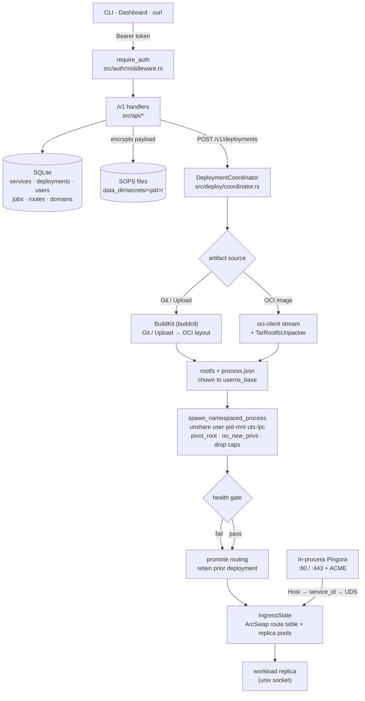

# Architecture overview

A single Rust binary contains both the HTTP control plane and the node agent,
separated internally so they can split later if a multi-node ADR is accepted
([ADR-001](design-decisions.md)). All persisted IDs are **UUIDv7**.

## Subsystems

| Subsystem | Responsibility | ADRs |
| --- | --- | --- |
| **API** (`src/api`, `src/app`) | `axum` handlers under `/v1`, bearer-protected | 008, 017 |
| **Auth** (`src/auth`) | Token resolution → `Principal`, project-scoped role checks | 008 |
| **State** (`src/state`, `src/repo`) | SQLite (`rusqlite`, bundled), per-aggregate repositories | 006, 012 |
| **Secrets** (`src/secrets`) | SOPS-encrypted files; SQLite holds references only | 021, 023 |
| **Artifacts** (`src/artifacts`, `src/oci`) | Git-over-SSH (BuildKit) + in-process OCI pulls | 011, 015, 022 |
| **Deploy** (`src/deploy`) | `DeploymentCoordinator`: build → start → health-gate → promote | 024, 028 |
| **Runtime** (`src/runtime`, `src/syscall`) | Namespaces + cgroup v2 + overlay rootfs + cap drop | 003, 005, 019, 026 |
| **Ingress / TLS** (`src/ingress`) | In-process Pingora proxy + in-process ACME | 007, 016→020, 032, 035 |
| **Autoscale** (`src/autoscale`) | CPU/mem-driven scaling, scale-to-zero, resource ledger | 018 |
| **Scheduler** (`src/scheduler`) | tokio cron jobs, run-to-completion | 010 |
| **Observability** (`src/observability`) | Logs, metrics, access log from cgroup/procfs/statvfs | 009 |
| **Registry** (`src/registry`) | Hosted OCI registry (`/v2`) + GC | 031 |
| **Web** (`src/web`) | Embeds the SPA console via `rust-embed`, served as fallback | 004 |

Deployments are **health-gated**: Denia starts the new deployment, waits for the
configured HTTP health check, then atomically promotes routing and retains the
previous deployment for rollback.

## Request & deployment flow

See [Runtime isolation](runtime-isolation.md) and
[Ingress & TLS](ingress-and-tls.md) for the two most security-sensitive
subsystems, and the [Design Decisions](design-decisions.md) index for the full
ADR set.
